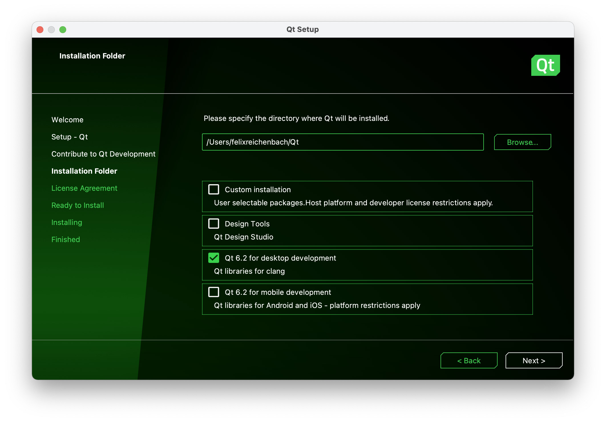
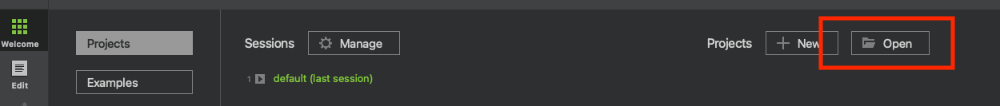
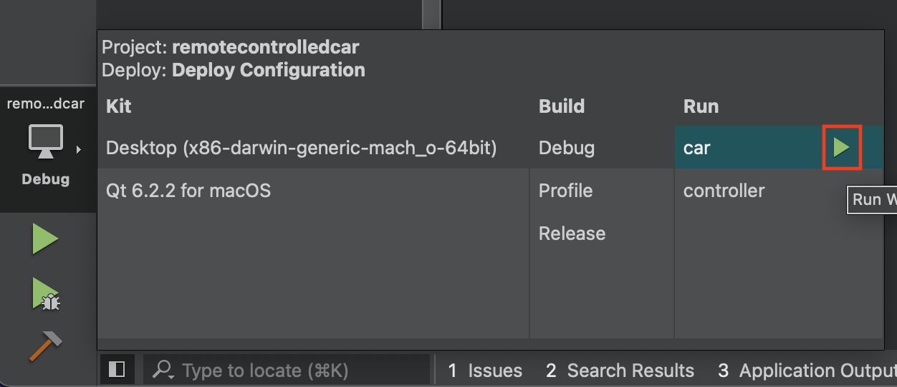
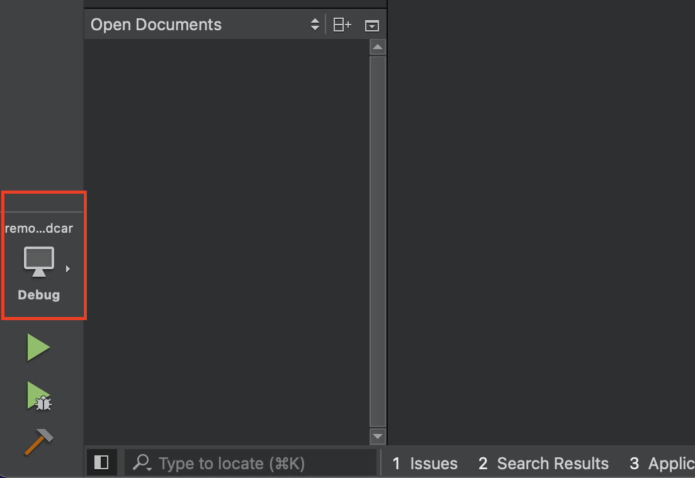

## Building Realm

In case you don't want to use the precompiled version, you can build Realm yourself from source.

### MacOS

Prerequisites:

* Building Realm requires Xcode 11.x or newer.


## Installing Realm

### MacOS / Linux

Prerequisites:

* git, cmake, cxx20

If the packages are not already installed:

```sh
/bin/bash -c "$(curl -fsSL https://raw.githubusercontent.com/Homebrew/install/HEAD/install.sh)"
Brew install git
Brew install cmake
Brew install cxx20 
```
Download the github repository: https://github.com/jsflax/realm-cpp-sdk

Move into the folder and execute the following commands:

```sh
git submodule update --init --recursive
mkdir build.debug
cd build.debug
cmake -D CMAKE_BUILD_TYPE=debug ..
sudo cmake --build . --target install  
```
Enter your password when asked to

Download the QT installer: https://www.qt.io/download-qt-installer?hsCtaTracking=99d9dd4f-5681-48d2-b096-470725510d34%7C074ddad0-fdef-4e53-8aa8-5e8a876d6ab4

Open the installer create a QT account when asked and select QT 6.2 as shown:



Once installed, Open QT and select Projects then Open



Then in the previously cloned github repository select examples/remotecontrolledcar/remotecontrolledcar.pro. Then select computer icon at the bottom left



and click on the green triangle to start the car app



Do the same with controller to start the controller app
